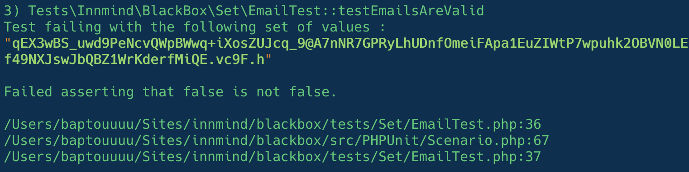
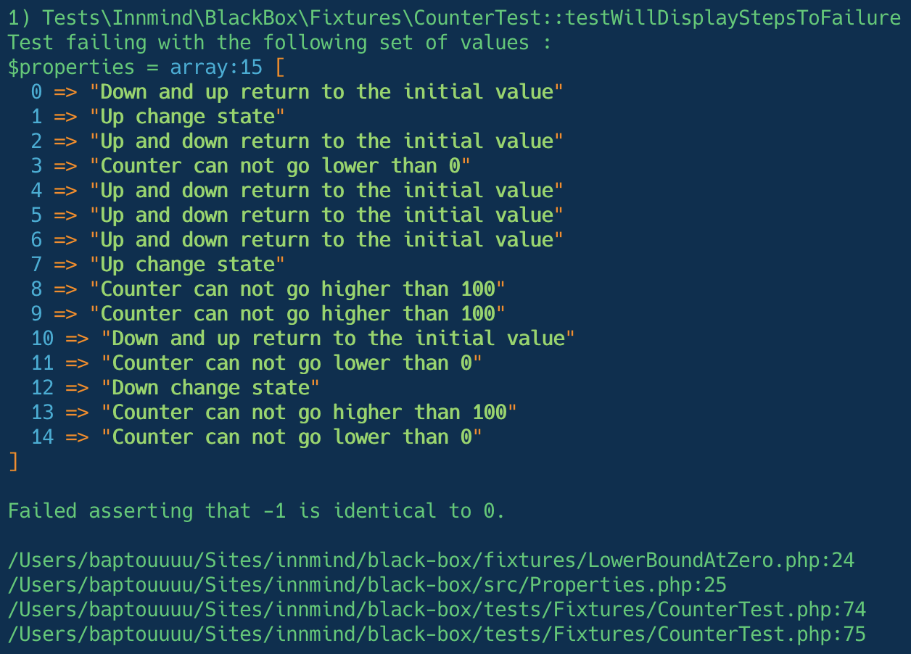

# BlackBox

[](https://codecov.io/gh/Innmind/BlackBox)
[](https://github.com/Innmind/BlackBox/actions?query=workflow%3ACI)
[](https://shepherd.dev/github/Innmind/BlackBox)

Contains an ensemble of sets to easily generate data for property based tests.

## Philosophy

When I run tests I need some data to assert the validity of my code, the first approach is to hardcode the test data in the test class itself but it lacks enough variety in order to make sure all (or at least enough) cases are covered. In order to generate data we can use a property based testing library such as [`giorgiosironi/eris`](https://packagist.org/packages/giorgiosironi/eris), but the problem is that for each test you need to redeclare the base sets of data you need test against.

The goal of this library is to help build higher order sets to facilitate the understanding of tests.

`BlackBox` comes with the `Set`s of primitives:
- [`Integers`](src/Set/Integers.php) -> `int`
- [`RealNumbers`](src/Set/RealNumbers.php) -> `float`
- [`Strings`](src/Set/Strings.php) -> `string`
- [`UnsafeStrings`](src/Set/UnsafeStrings.php) -> `string` (found [here](https://github.com/minimaxir/big-list-of-naughty-strings))
- [`Regex`](src/Set/Regex.php) -> `string`

User defined elements `Set`s can be defined with:
- [`Elements`](src/Set/Elements.php)
- [`FromGenerator`](src/Set/FromGenerator.php)

Higher order `Set`s allows you create structures:
- [`Decorate`](src/Set/Decorate.php) -> map a type `A` to a type `B`, ie an `int` to an object `Age`
- [`Composite`](src/Set/Composite.php) -> map many types to another unique type, ie `string $firstname` and `string $lastname` to an object `User($firstname, $lastname)`
- [`Sequence`](src/Set/Sequence.php) -> create an `array` containing multiple elements of the same type
- [`Either`](src/Set/Either.php) -> will generate either a type `A` or `B`, ie to create nullable `int`s via `Either(Integers::any(), Elements::of(null))`

## Installation

```sh
composer require innmind/black-box
```

## Usage

```php
use Innmind\BlackBox\{
    Set,
    PHPUnit\BlackBox,
};

final class Counter
{
    private int $current;

    public function __construct(int $initial = 0)
    {
        $this->current = $initial;
    }

    public function up(): void
    {
        if ($this->current === 100) {
            return;
        }

        ++$this->current;
    }

    public function down(): void
    {
        if ($this->current === 0) {
            return;
        }

        --$this->current;
    }

    public function current(): int
    {
        return $this->current;
    }
}

class CounterTest extends \PHPUnit\Framework\TestCase
{
    use BlackBox;

    public function testCounterValueIsAlwaysHigherAfterCountingUp()
    {
        $this
            ->forAll(
                Set\Integers::between(0, 100), // counter bounds
            )
            ->then(function(int $initial) {
                $counter = new Counter($initial);
                $counter->up();

                $this->assertGreaterThan($initial, $counter->value());
            });
    }
}
```

This really simple example show how the test class is focused on the behaviour and not about the construction of the test data.

By default the library supports the shrinking of data to help you find the smallest possible set of values that makes your test fail. To help you ease the debugging of the code you can use the printer class `Innmind\BlackBox\PHPUnit\ResultPrinterV8` that will print the set of generated data that made your test fail.



### Stateful testing

When we write tests we tend to focus on evaluating the behaviour when doing one action (like in our counter example above). This technique help us cover most of our code, but when we deal with stateful systems (such as a counter, an entity or a daemon) it becomes harder to make sure all succession of mutations will always result in a coherent new state.

Once again Property Based Testing can help us improve the coverage of behaviours. Instead of describing the initial test to the framework and manually do one action, we describe to the framework all the properties that our system must hold and the framework will try to find a succession of actions that will break our properties.

If we reuse the counter example from above, the property would be written like this:

```php
use Innmind\BlackBox\Property;
use PHPUnit\Framework\Assert;

final class UpChangeState implements Property
{
    public function name(): string
    {
        return 'Counting up always end in a higher count';
    }

    public function applicableTo(object $counter): bool
    {
        return $counter->current() < 100; // since upper bound is 100
    }

    public function ensureHeldBy(object $counter): object
    {
        $initial = $counter->current();
        $counter->up();

        Assert::assertGreaterThan($initial, $counter->current());

        return $counter;
    }
}
```

With all the other properties (provided in the [`fixtures`](fixtures/) folder) to test the whole behaviour the test in phpunit would then look like this:

```php
class CounterTest extends \PHPUnit\Framework\TestCase
{
    use BlackBox;

    public function testProperties()
    {
        $this
            ->forAll(
                Set\Properties::any(
                    Set\Property::of(DownAndUpIsAnIdentityFunction::class),
                    Set\Property::of(DownChangeState::class),
                    Set\Property::of(RaiseBy::class, Set\Integers::between(1, 99)),
                    Set\Property::of(UpAndDownIsAnIdentityFunction::class),
                    Set\Property::of(UpChangeState::class),
                    Set\Property::of(UpperBoundAtHundred::class),
                ),
                Set\Integers::between(0, 100), // counter bounds
            )
            ->then(function($scenario, $initial) {
                $scenario->ensureHeldBy(new Counter($initial));
            });
    }
}
```

**Note**: you should declare the properties as the first set of `forAll` to make sure it is shrunk first.

The above example would generate multiple scenarii of counting up and down (it tries to apply up to 100 properties per scenario). In the case it found a failing scenario, it would be displayed as follow in your terminal:



**Note**: this counter example is used as the test process of this framework, all properties to prove the behaviour of the counter can be found in the [`fixtures/`](fixtures/) folder.

**Note 2**: this example was taken from an article by [Johannes Link](https://twitter.com/johanneslink) on [Model-based Testing](https://johanneslink.net/model-based-testing/).

## Configuration

### Set size

By default it will run 100 iterations of different values to test your properties. You can manually change this value in each test by calling `$this->forAll(/** $set */)->take($somethingOtherThan100)`.

Specifying a different value can be repetitive if you want all your tests to run the same number of iterations, with this in mind you can specify an [env variable](https://phpunit.readthedocs.io/en/8.5/configuration.html#the-env-element) named `BLACKBOX_SET_SIZE` in your `phpunit.xml.dist` set to the number of iterations you want for all your tests.

**Note**: of course you can override this value locally in each tests.

### Properties informations

By default when a set of properties fail the printer will only display the named of each property to have a more digest information. However in some cases (like paramaterized properties) you may want to have the whole property object displayed to help debug complex scenarii, for such case you can use the environment variable `BLACKBOX_DETAILED_PROPERTIES` with a value set to `1`.
