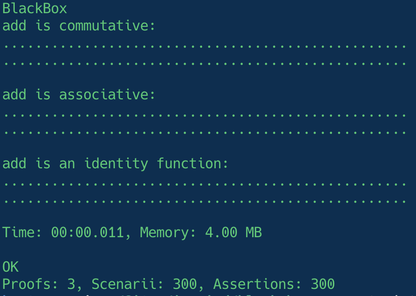

# BlackBox

[](https://codecov.io/gh/Innmind/BlackBox)
[](https://github.com/Innmind/BlackBox/actions?query=workflow%3ACI)
[](https://shepherd.dev/github/Innmind/BlackBox)

BlackBox is a Property Based Testing framework and test runner.

Property Based Testing is a way to verify a piece of code always behave the same way (aka a Property) by testing it with multiple values of a given type.

The common introduction to this approach is the `add` function that has 3 properties:
- it is commutative
- it is associative
- it is an identity function

To prove this via BlackBox you can do it this way:

```php
use Innmind\BlackBox\{
    Application,
    Set,
    Runner\Assert,
};

Application::new([])
    ->tryToProve(static function() {
        yield proof(
            'add is commutative',
            given(
                Set::integers(),
                Set::integers(),
            ),
            static fn(Assert $assert, int $a, int $b) => $assert->same(
                add($a, $b),
                add($b, $a),
            ),
        );
        yield proof(
            'add is associative',
            given(
                Set::integers(),
                Set::integers(),
                Set::integers(),
            ),
            static fn(Assert $assert, int $a, int $b, int $c) => $assert->same(
                add(add($a, $b), $c),
                add($a, add($b, $c)),
            ),
        );
        yield proof(
            'add is an identity function',
            given(Set::integers()),
            static fn(Assert $assert, int $a) => $assert->same(
                $a,
                add($a, 0),
            ),
        );
    })
    ->exit();
```

By default BlackBox will generate 100 scenarii for each proof.



> **Note** BlackBox use the term _proof_ to emphasize that you are testing behaviours not specific scenarii, but these are NOT [formal proofs](https://en.wikipedia.org/wiki/Formal_proof)

## Installation

```sh
composer require --dev innmind/black-box
```

## Documentation

Full documentation can be found in the [here](https://innmind.github.io/BlackBox/).
