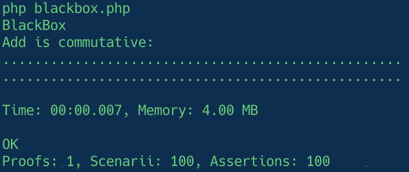

# First proof

Let's reuse the previous `add` example. As described in the [preface](../preface/terminology.md) a proof is a generalization of a test.

But before let's rewrite the previous test with the proof syntax:

```php title="blackbox.php" hl_lines="4 9 11-15 18 22"
use Innmind\BlackBox\{
    Application,
    Runner\Assert,
    Set,
};

Application::new([])
    ->tryToProve(static function(): \Generator {
        yield proof(
            'Add is commutative',
            given(
                Set::of(1),
                Set::of(2),
            ),
            static function(Assert $assert, int $a, int $b): void {
                $assert->same(
                    3,
                    add($a, $b),
                );
                $assert->same(
                    3,
                    add($b, $a),
                );
            },
        );
    })
    ->exit();
```

This behaves exactly as the test one. The hardcoded values `1` and `2` are now declared in hardcoded `Set`s. Every `Set` passed to the `given` function adds an argument to the function passed to `proof`. When it runs BlackBox randomly peaks a value in each `Set`. In this case it always peaks `1` and `2`. This means `$a` is always `1` and `$b` always `2`.

BlackBox by default runs a proof `100` times.

??? tip
    You can change the number of scenarii run for each proof like this:

    ```php title="blackbox.php" hl_lines="8"
    use Innmind\BlackBox\{
        Application,
        Runner\Assert,
        Set,
    };

    Application::new([])
        ->scenariiPerProof(10)
        ->tryToProve(static function(): \Generator {
            yield proof(
                'Add is commutative',
                given(
                    Set::of(1),
                    Set::of(2),
                ),
                static function(Assert $assert, int $a, int $b): void {
                    $assert->same(
                        3,
                        add($a, $b),
                    );
                    $assert->same(
                        3,
                        add($b, $a),
                    );
                },
            );
        })
        ->exit();
    ```

Of course when the values are harcoded it's pointless to run the same proof multiple times.

Let's generalize our proof:

```php title="blackbox.php" hl_lines="12-13 17-18"
use Innmind\BlackBox\{
    Application,
    Runner\Assert,
    Set,
};

Application::new([])
    ->tryToProve(static function(): \Generator {
        yield proof(
            'Add is commutative',
            given(
                Set::integers(),
                Set::integers(),
            ),
            static function(Assert $assert, int $a, int $b): void {
                $assert->same(
                    add($a, $b),
                    add($b, $a),
                );
            },
        );
    })
    ->exit();
```

Now `$a` or `$b` can be any integer between `PHP_INT_MIN` and `PHP_INT_MAX`.

Because we don't know the concrete input values we can no longer hardcode the expected output. We can only rely on the function we try to test. That's why we can only test behaviour and not assume any implementation detail.

!!! abstract ""
    Hence the name _BlackBox_!

When run this would produce this output:


