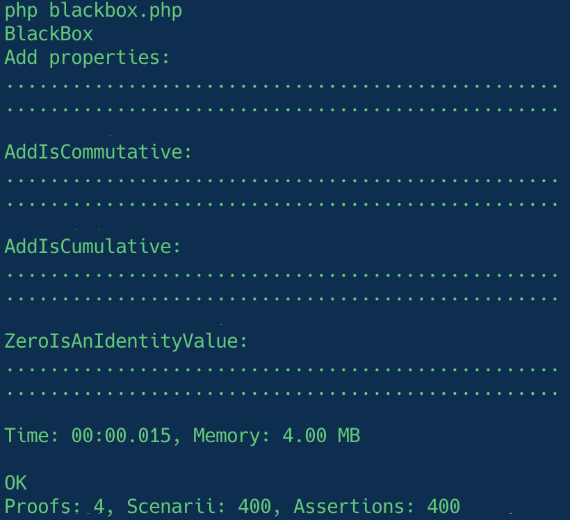

# First property

A property is a [proof](proof.md) expressed as object. The previous proof becomes:

```php title="AddIsCommutative.php"
use Innmind\BlackBox\{
    Property,
    Set,
    Runner\Assert,
};

/**
 * @implements Property<Add>
 */
final class AddIsCommutative implements Property
{
    private function __construct(
        private int $a,
        private int $b,
    ) {}

    /**
     * @return Set<self>
     */
    public static function any(): Set
    {
        return Set\Composite::immutable(
            static fn(int $a, int $b) => new self($a, $b),
            Set\Integers::any(),
            Set\Integers::any(),
        );
    }

    public function applicableTo(object $add): bool
    {
        return true; #(1)
    }

    public function ensureHeldBy(Assert $assert, object $add): object
    {
        $assert->same(
            $add($this->a, $this->b),
            $add($this->b, $this->a),
        );

        return $add;
    }
}
```

1. This allows you to not run `ensureHeldBy` based on `$this->a` or `$this->b`.

As described in the [preface](../preface/terminology.md#property) a property applies to objects. This means that you must replace your `add` function by an `Add` class with the `__invoke` method.

`@implements Property<Add>` tells [Psalm](https://psalm.dev) that the `$add` argument of `applicableTo` and `ensureHeldBy` is an instance of `Add`.

You can run this property like this:

=== "Explicit"
    ```php title="blackbox.php"
    use Innmind\BlackBox\{
        Application,
        Runner\Assert,
        Set,
    };

    Application::new([])
        ->tryToProve(static function(): \Generator {
            $add = new Add;

            yield proof(
                'Add is commutative',
                given(
                    AddIsCommutative::any()->filter(
                        static fn($property) => $property->applicableTo($add),
                    ),
                ),
                static function(
                    Assert $assert,
                    AddIsCommutative $property
                ) use ($add): void {
                    $property->ensureHeldBy($assert, $add);
                },
            );
        })
        ->exit();
    ```

    ??? note
        Note that since you use a `Generator` you can setup a test/proof/property by executing any PHP code before yielding them.

=== "Shortcut"
    ```php title="blackbox.php"
    use Innmind\BlackBox\{
        Application,
        Runner\Assert,
        Set,
    };

    Application::new([])
        ->tryToProve(static function(): \Generator {
            yield property(
                AddIsCommutative::class,
                Set\Elements::of(new Add),
            );
        })
        ->exit();
    ```

    ??? note
        This shortcut shows that the Model being tested can be generated via `Set`s. You can randomize the initial state of a Model this way.

As said before properties come in groups. To fully prove the behaviour of `Add` there's 2 more properties required:

- `AddIsCumulative`
- `ZeroIsAnIdentityValue`

To run all possible scenarii you would write:

```php title="blackbox.php"
use Innmind\BlackBox\{
    Application,
    Runner\Assert,
    Set,
};

Application::new([])
    ->tryToProve(static function(): \Generator {
        yield properties(
            'Add properties',
            Set\Properties::any(
                AddIsCommutative::any(),
                AddIsCumulative::any(),
                ZeroIsAnIdentityValue::any(),
            ),
            Set\Elements::of(new Add),
        );

        yield property(
            AddIsCommutative::class,
            Set\Elements::of(new Add),
        );

        yield property(
            AddIsCumulative::class,
            Set\Elements::of(new Add),
        );

        yield property(
            ZeroIsAnIdentityValue::class,
            Set\Elements::of(new Add),
        );
    })
    ->exit();
```

With this you run each property a `100` times and a `100` combinations of them being applied successively on the same `Add` instance.

When run, if your `Add` implementation is correct, it should output:


