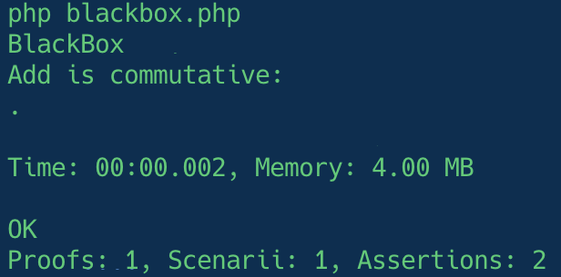

# First test

Let's reuse the `add` example from the [preface](../preface/terminology.md#proof).

This function doesn't exist. For the sake of learning you should try to implement it. It will show you how BlackBox can help you fix your implementation.

```php title="blackbox.php"
use Innmind\BlackBox\{
    Application,
    Runner\Assert,
};

Application::new([])
    ->tryToProve(static function(): \Generator {
        yield test(
            'Add is commutative',
            static function(Assert $assert): void {
                $assert->same(
                    3,
                    add(1, 2),
                );
                $assert->same(
                    3,
                    add(2, 1),
                );
            },
        );
    })
    ->exit();
```

When run this would produce this output:



Here we `yield` only one test but you can add as many as you want.

You can head to the [Assert](../assert/index.md) chapter to learn the various assertions you can use.

??? tip
    This example uses the global function `test`. This works fine. However if you're not at ease you can use namespaced functions like this:

    ```php title="blackbox.php" hl_lines="5 8"
    use Innmind\BlackBox\{
        Application,
        Runner\Assert,
    };
    use function Innmind\BlackBox\Runner\test;

    Application::new([])
        ->disableGlobalFunctions()
        ->tryToProve(static function(): \Generator {
            yield test(
                'Add is commutative',
                static function(Assert $assert): void {
                    $assert->same(
                        3,
                        add(1, 2),
                    );
                    $assert->same(
                        3,
                        add(2, 1),
                    );
                },
            );
        })
        ->exit();
    ```
