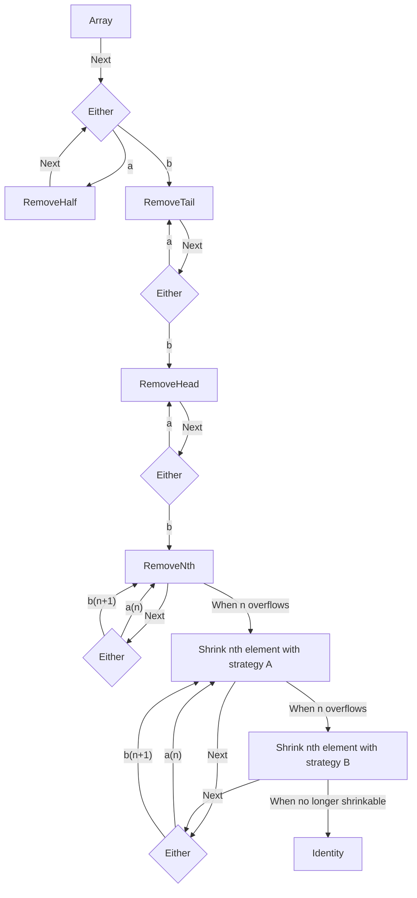
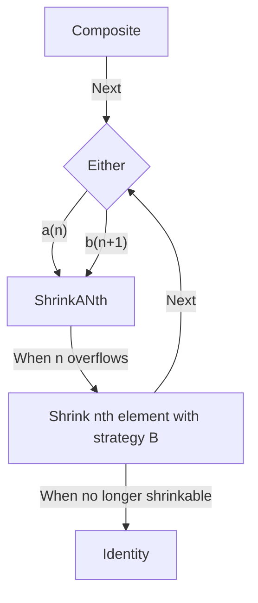

# Shrinking

## `Sequence`



This design makes sure all elements are shrunk to their minimum values. It's assured when shrinking elements of the `array` with their `a` or `b` strategy. When we apply a strategy makes the test pass we try to shrink the next available value in the array. This privileges first shrinking values that do not affect the test.

This strategy means the values that affect the failing test are shrunk last. So it will take more shrinking steps to find the minimum values that make a test fail.

## `Composite`



This design is identical to the [`Sequence` one](#sequence) except it doesn't need to remove elements from the composite. It only shrinks elements of the composite.

## `Seed`ed values

The complexity of seeded values lies with the filtering of these values when shrinking.

Let's take a simple example:

```php
use Innmind\BlackBox\Set;

Set::strings()->filter(static fn(string $string) => $string !== '');
```

The `Set` can apply this filter and not yield any empty string. And for any yielded ones if can access the predicate when shrinking the strings in order to not create `Dichotomy`s with invalid strings.

The problem with seeded values can be expressed with this example:

```php
use Innmind\BlackBox\Set;

Set::integers()
    ->flatMap(
        static fn(Set\Seed $int) => Set::strings()->map(
            static fn(string $string) => $int->map(
                static fn(int $int) => $int.$string,
            ),
        ),
    )
    ->filter(static fn(string $string) => $string !== '0');
```

Here when the `filter` is applied it abstracts that the string is seeded with a leading `int`. But in the implementation it can't know where the seed comes from. So it can't affect the way the `int` could be shrunk.

The problem here is that the `Dichotomy` attached to any `Value` is _statically_ defined when yielding it.

To still correctly filter out seeded values the predicate is attached to the `Value` object and is check on both values generated by a `Dichotomy` to make sure both are acceptable. If not both are then it prevents shrinking the seed.

This design prevents shrinking to the minimum values in the case only one of the shrunk values is acceptable.

!!! note ""
    A research should be conducted to improve the shrinking system to fix this shortcoming of seeded values.
