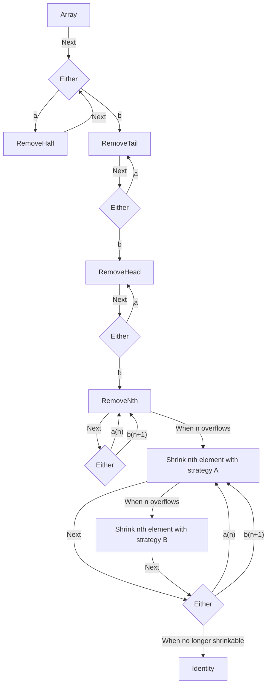

# Shrinking

## `Sequence`

This design makes sure all elements are shrunk to their minimum values. It's assured when shrinking elements of the `array` with their `a` or `b` strategy. When we apply a strategy makes the test pass we try to shrink the next available value in the array. This privileges first shrinking values that do not affect the test.

This strategy means the values that affect the failing test are shrunk last. So it will take more shrinking steps to find the minimum values that make a test fail.
