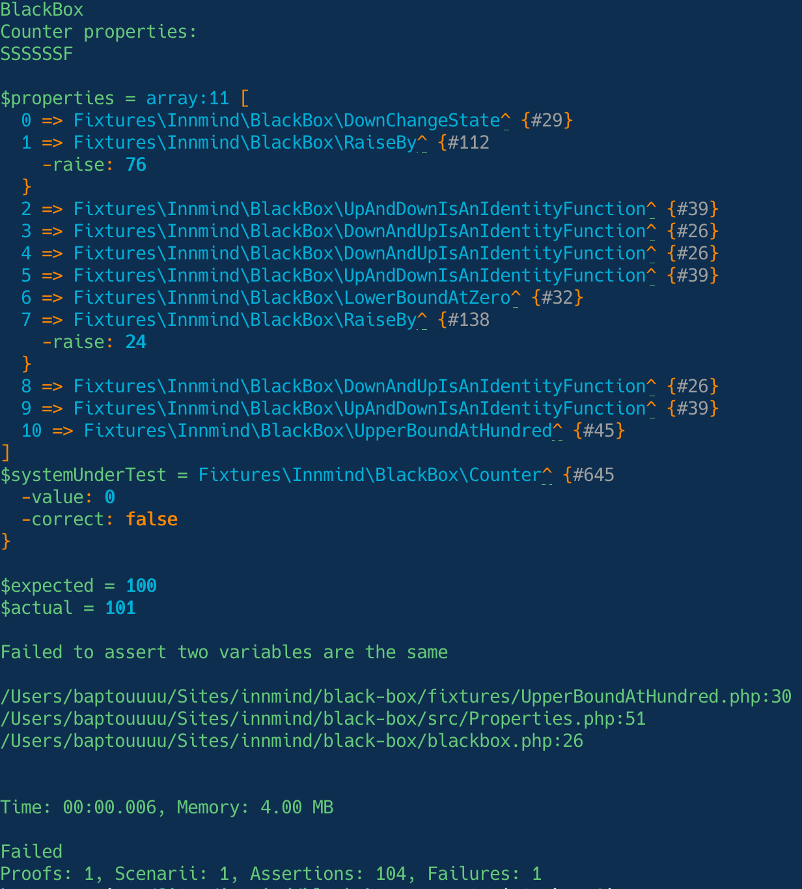

# Writing your first property

Most of the time writing a [proof](proof.md) is enough if you want to verify a unit of code (a function, an object or a whole application). But if you want to verify the behaviour of multiple implementation you can do this with a `Property`.

For this exercice we'll use the `Counter` provided in the [fixtures](../fixtures/Counter.php) as the implementation we want to prove. This `Counter` is a simple class where we can increment or decrement the internal counter value, and this value can't go below `0` or above `100`. One of its properties is that if the counter is below `100` then after calling the `up()` method the new value is higher than the previous one. We can write this property like this:

```php
use Innmind\BlackBox\{
    Property,
    Set,
    Runner\Assert,
};

/**
 * @implements Property<Counter>
 */
final class UpChangeState implements Property
{
    /**
     * @return Set<self>
     */
    public static function any(): Set
    {
        return Set\Elements::of(new self);
    }

    public function applicableTo(object $counter): bool
    {
        return $counter->current() < 100;
    }

    public function ensureHeldBy(Assert $assert, object $counter): object
    {
        $initial = $counter->current();
        $counter->up();
        $assert
            ->number($initial)
            ->lessThan($counter->current());

        return $counter;
    }
}
```

And to verify that the `Counter` implementation is correct:

```php
use Innmind\BlackBox\{
    Application,
    Set,
};

Application::new([])
    ->tryToProve(static function() {
        yield property(
            UpChangeState::class,
            Set\Integers::between(0, 99)->map(
                static fn($initial) => new Counter($initial),
            ),
        );
    })
    ->exit();
```

Since the behaviour is now declared in a class you can verify the same property against multiple implementations.

## Model based testing

So far we've verified a single property on our `Counter` but there's 7 of them to verify the complete behaviour. Verifying each property individually on a `Counter` is great but is not enough as there may be a bug only when a sequence of steps occurs. To track this sort of bug we use Model Based Testing.

With BlackBox this approach is straight forward once you already have defined your properties.

For the `Counter` it is as easy as:

```php
use Innmind\BlackBox\{
    Application,
    Set,
};

Application::new([])
    ->tryToProve(static function() {
        yield properties(
            'Counter properties',
            Set\Properties::any(
                DownAndUpIsAnIdentityFunction::any(),
                DownChangeState::any(),
                LowerBoundAtZero::any(),
                RaiseBy::any(),
                UpAndDownIsAnIdentityFunction::any(),
                UpChangeState::any(),
                UpperBoundAtHundred::any(),
            ),
            Set\Integers::between(0, 100)->map(
                static fn($initial) => new Counter($initial),
            ),
        );
    })
    ->exit();
```

This will create a random sequence of steps from the provided properties and apply them on an instance of `Counter`. This sequence may contain a same property multiple times.

This approach is extremely powerful as it can find sequences of steps you can't think on your own or have the time and patience to write manually, meaning it would probably your users that would encounter such bugs. And writing a non regression test also becomes very simple as the framework shows you the code to write.



And like with any proof BlackBox will find the smallest sequence of steps it can that lead to the failure.
